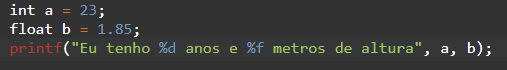
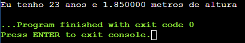

# Aula Ana Laura

## Conteúdo da apostila:

### O Básico:

- `#include <bits/stdc++.h`: Biblioteca de comandos com tudo que é padrão pro C++ (`printf`, `scanf`, etc.);

-  `int main() {}`: é a função que é chamada sempre que você roda um arquivo C/C++, tudo que estiver dentro dela **vai** acontecer;

- `printf()`: O programa roda sempre num terminal (aquela telinha que sempre mostra as coisas do código), o `printf` vai imprimir no terminal qualquer coisa que você pedir.
 `printf("Olá mundo!")` vai mostrar a frase *Olá, mundo!*.

- `return 0`: É mais um padrão do programa do que algo realmente explicável. Quando o computador rodar o seu código, ele vai ficar esperando que algum número chegue de volta pra ele como resultado. O `return 0` é você falando pra ele que "*Funcionou! Tudo certo por aqui.*"

---

### Variáveis e seus tipos:

**Criar uma variável é criar um bloco de código com um nome e algum valor**

 *`variável idade tem o valor 15`*

 Mais fácil de entender?. Em **C**, pra criar uma variável você precisa *primeiro* falar ao computador qual o tipo dela! Estamos fazendo uma letra? Um número? 

 É aí que vem o que chamamos de tipagens. Os nomes delas em inglês são muito mais esclarecedores, mas traduzindo temos:
 - **int = integer = inteiro** - São números maiores ou menores que 0 e não possuem casas decimais;
 - **float = real** - números com casas decimais (ex: 2.1, 5.62, 0.1 ...);
 
 Quando precisamos de uma letra podemos utilizar **char**, em inglês *character*, em português, *caractere*. 

 Traduzinho o que fizemos lá em cima para a linguagem de programação, é só colocar o tipo da variável antes do nome dela, e usar o "=" pra dar um valor. Temos:

 *`int idade = 15;`*

 | Tipo | Descrição |
 | ----------- | ----------- |
 | *int* | Inteiro |
 | *float* | Real |
 | *char* | Caracter |

---

### Imprimir variáveis usando o *printf()*:

 O `printf()` pode ser usado pra mostrar qualquer escrita que quiser na tela.
 
 Se utilizarmos `printf("Olá! Tudo bem?")`, quando rodar o programa, a exata amesma frase vai aparecer. Mas e se quisermos imprimir uma variável?

 
 
 Pra cada tipo de variável, existe um símbolo que deve ser colocado na frase. E não esqueça de colocar também a variável que deve aparecer no lugar daquele símbolo, ela sempre virá depois da frase, separada por uma vírgula.

 | Tipo | Descrição | Símbolo
 | ----------- | ----------- | ----------- |
 | *int* | Inteiro | **%d** | 
 | *float* | Real | **%f**
 | *char* | Caracter | **%c**

 O código acima mostra no terminal:

 Caso queira mostrar mais de uma variável, é só continuar adicionando os símbolos onde desejar, e adicionar as variáveis no fim, separadas sempre por vírgulas.

 👇👇👇👇

 

 **Observação:** caso queira limitar a quantidade de números após o ponto em um número real, é só colocar o símbolo dessa maneira: **`%f.2f`** - substituindo o número 2 pela quantidade de casas que desejar.