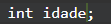
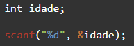
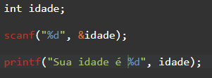
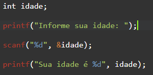
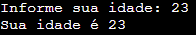
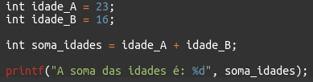
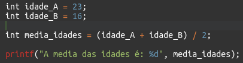
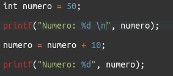
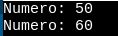

# Aula C/C++

### O Básico:

- `#include <bits/stdc++.h`: Biblioteca de comandos com tudo que é padrão pro C++ (`printf`, `scanf`, etc.);

-  `int main() {}`: é a função que é chamada sempre que você roda um arquivo C/C++, tudo que estiver dentro dela **vai** acontecer;

- `printf()`: O programa roda sempre num terminal (aquela telinha que sempre mostra as coisas do código), o `printf` vai imprimir no terminal qualquer coisa que você pedir.
 `printf("Olá mundo!")` vai mostrar a frase *Olá, mundo!*.

- `return 0`: É mais um padrão do programa do que algo realmente explicável. Quando o computador rodar o seu código, ele vai ficar esperando que algum número chegue de volta pra ele como resultado. O `return 0` é você falando pra ele que "*Funcionou! Tudo certo por aqui.*"

---

### Variáveis e seus tipos:

**Criar uma variável é criar um bloco de código com um nome e algum valor.**

 *`variável idade tem o valor 15`*

 Mais fácil de entender?. Em **C**, pra criar uma variável você precisa *primeiro* falar ao computador qual o tipo dela! Estamos fazendo uma letra? Um número? 

 É aí que vem o que chamamos de tipagens. Os nomes delas em inglês são muito mais esclarecedores, mas traduzindo temos:
 - **int = integer = inteiro** - São números maiores ou menores que 0 e não possuem casas decimais;
 - **float = real** - números com casas decimais (ex: 2.1, 5.62, 0.1 ...);
 
 Quando precisamos de uma letra podemos utilizar **char**, em inglês *character*, em português, *caractere*. 

 Traduzinho o que fizemos lá em cima para a linguagem de programação, é só colocar o tipo da variável antes do nome dela, e usar o "=" pra dar um valor. Temos:

 *`int idade = 15;`* ou apenas `int idade;` caso não queira dar um valor agora.

 | Tipo | Descrição |
 | ----------- | ----------- |
 | *int* | Inteiro |
 | *float* | Real |
 | *char* | Caracter |

---

### Imprimir variáveis usando o *printf()*:

 O `printf()` pode ser usado pra mostrar qualquer escrita que quiser na tela.
 
 Se utilizarmos `printf("Olá! Tudo bem?")`, quando rodar o programa, a exata amesma frase vai aparecer. Mas e se quisermos imprimir uma variável?

 
 
 Pra cada tipo de variável, existe um símbolo que deve ser colocado na frase. E não esqueça de colocar também a variável que deve aparecer no lugar daquele símbolo, ela sempre virá depois da frase, separada por uma vírgula.

 | Tipo | Descrição | Símbolo
 | ----------- | ----------- | ----------- |
 | *int* | Inteiro | **%d** | 
 | *float* | Real | **%f**
 | *char* | Caracter | **%c**

 O código acima mostra no terminal:


 Caso queira mostrar mais de uma variável, é só continuar adicionando os símbolos onde desejar, e adicionar as variáveis no fim, separadas sempre por vírgulas.


 👇👇👇👇


 > **Observação:** caso queira limitar a quantidade de números após o ponto em um número real, é só colocar o símbolo dessa maneira: **`%f.2f`** - substituindo o número 2 pela quantidade de casas que desejar.

---

### Pedir variáveis usando o *scanf()*

Caso você precise que seu usuário informe algo pra você, é só usar o `scanf()`. Você pode criar uma variável sem passar qualquer valor pra ela, apenas informando o tipo.



Depois de criar, use o `scanf()` de maneira bem parecida com o `printf()`, usando o símbolo devido pro tipo daquela variável e passando ela após a vírgula.



> Vale notar o uso do símbolo "**&**" antes do nome da variável. Ele serve pra avisar ao computador o endereço daquela variável na memória da máquina. É algo mais complexo e talvez não valhe a pena o entendimento agora, mas não deve esquecer de usá-lo no `scanf()`

Depois, a variável estará oficialmente com o valor que foi informado pelo usuário. Só pra ter certeza, vamos usar um `printf()` pra ver como ela ficou:



Pra dar uma embelezada, ainda podemos colocar um `printf()` antes pra informar direitinho ao usuário o que estamos pedindo dele:

 


Na primeira linha, inseri o número que desejava no `scanf()`, e, logo depois, podemos ver que o programa imprimiu a frase com o 23 com sucesso.

---

### Operações matemáticas:

 | Símbolo | Operação | Exemplo
 | ----------- | ----------- | ----------- |
 | + | Soma | 2+2 | 
 | - | Subtração | 5-3
 | / | Divisão | 4/2
 | * | Multiplicação | 2*2

 Fazer operações matemáticas com variáveis é mais simples do que parece: 

 

 Caso precise que uma parte da expressão rode antes, pode utilizar os parênteses também:

 

 > Obs: As expressões seguem a mesma regra básica da matemática. Multiplicação e divisão sempre acontecerão antes de soma e subtração.

 Caso queira somar ou subtrair um determinado número de uma variável que já tem um valor, você só precisa reatribuir a ela seu próprio valor mais, ou menos, o número que deseja.

 

Veja que no exemplo acima, a variável número tinha o valor de cinquenta. Após dar a ela o valor dela mesma mais 10, ela começa a valer 60. 

 ---

 ### Condições:

 Para checar condições no código, utilizamos a estrutura de `if` e `else`, literalmente traduzidos para `se` e `se não`. 

 ```
  se idade maior que 18 {
    é maior de idade
  } 
  se não {
    é menor de idade
  }
```

No código, você sempre deve utilizar a estrutura de chaves para criar um bloco de código que deve acontecer se as condições (dentro de parênteses) forem ou não atendidas. Em **C**, temos:

 ```C
    if (idade > 18) {
        printf("Maior de idade");
    } 
    else {
        printf("Menor de idade");
    }
 ```
---

Para checar condições, temos um determinado número de símbolos que podem ser usados. Para checagens tanto de letras quanto números, temos:

 | Nome | Símbolo | Exemplo
 | ----------- | ----------- | ----------- |
 | Igual à | == | `if (letra == "R") ` 
 | Diferente de | != | `if (idade != 6)`

Existem outros específicos para condições numéricas:

 | Nome | Símbolo | Exemplo
 | ----------- | ----------- | ----------- |
 | Maior que | > | `if (media > 6)  `
 | Menor que | < | `if (idade < 18)`
 | Maior que ou igual a | >= | `if (idade >= 18)`
 | Menor que ou igual a | <= | `if (resultado <= 1)`

Sempre que uma condição for verdadeira, o bloco de código dentro das chaves do `if` vai rodar. Se a condição não for real, então será o bloco de códigos no `else`.

---

Caso precise checar várias condições de uma vez, utilizamos os chamados "*Operadores lógicos*":

 | Nome | Símbolo | Exemplo
 | ----------- | ----------- | ----------- |
 | E| && | `if (idade > 18 && altura > 1.8) ` 
 | Ou | \|\| | `if (preco > 100 \|\| desconto > 10)`

 ---